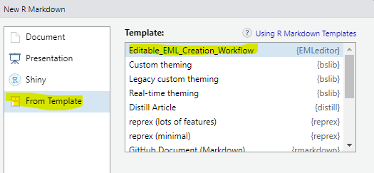

<!-- README.md is generated from README.Rmd. Please edit that file -->

<!-- badges: start -->
[](https://github.com/nationalparkservice/NPSdataverse/actions/workflows/R-CMD-check.yaml)
<!-- badges: end -->

# NPSdataverse


NPSdataverse loads a suite of R packages for creating, manipulating, and
accessing data packages including interacting with DataStore. This is an
early version of the NPSdataverse. Please request enhancements and bug
fixes through
[Issues](https://github.com/nationalparkservice/NPSdataverse/issues).

## Installation

You can install the development version of NPSdataverse from
[GitHub](https://github.com/) with:

``` r
# install.packages("devtools")
devtools::install_github("nationalparkservice/NPSdataverse")
```

NPSdataverse will install the following R packages:

| Package               | Location                                           |
|-----------------------|----------------------------------------------------|
| **QCkit**             | <https://nationalparkservice.github.io/QCkit/>     |
| EMLassemblyline (EAL) | <https://ediorg.github.io/EMLassemblyline/>        |
| EML                   | <https://www.cran-e.com/package/EML>               |
| **EMLeditor**         | <https://nationalparkservice.github.io/EMLeditor/> |
| **DPchecker**         | <https://nationalparkservice.github.io/DPchecker/> |
| **NPSutils**          | <https://nationalparkservice.github.io/NPSutils/>  |

------------------------------------------------------------------------

(R packages in **bold** are developed by NPS)

## Trouble shooting installation

Each package within the NPSdataverse has a number of dependencies, most
of which are hosted on CRAN. During the initial install of NPSdataverse,
you may be prompted to install or update these dependencies. The initial
installation can take some time and require multiple iterative package
updates/installs. Depending on how they were initially installed, some
dependent packages may fail update or to install. In this case you can
try running

``` r
.libPaths()
```

to find where your packages are located on your local machine. Navigate
to that location and delete the offending package. Then try to
re-install.

## Updating NPSdataverse packages

Many of the NPSdataverse packages are in a phase of rapid development.
When you load the NPSdataverse (using `library(NPSdataverse)`), if you
are online, NPSdataverse will check for new versions of the packages
stored on GitHub (all the packages except r/EML). NPSdataverse will tell
you if all your packages are up to date. Conversely if any of the
NPSdataverse packages need to be updated, NPSdataverse will indicate
which packages need updating and how to perform the updates. If you do
not get any notices about whether your packages are up to date or not,
then the NPSdataverse package itself needs to be updated. See
Installation for instructions on how to update the NPSdataverse package.

## Creating data packages

If you are you are creating a data package and need to generate EML
metadata make sure all of your .csv data files are in a single folder.

After loading NPSdataverse, from within Rstudio select the “File” menu.
Select “New File” from the drop down menu and choose “R Markdown”. In
the dialog box that pops up, select “From Template” and then click on
the template labelled “Editable_EML_Creation_Workflow” and click “OK”.




This will open a new file on that you can edit to generate EML metadata
for your data package. See the [web pages associated with
EMLeditor](https://nationalparkservice.github.io/EMLeditor/) for
additional information, instructions, and examples.
